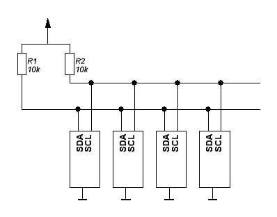

# I2C bus

**I²C - Inter-Integrated Circuit**

Разработана фирмой Philips Semiconductors в начале 1980-х как простая 8-битная шина внутренней связи для создания управляющей электроники. Была рассчитана на частоту 100 кГц.

Стандартизована в 1992 году, в первой версии к стандартному режиму 100 кбит/с добавлен скоростной (Fast-mode, Fm) режим 400 кбит/с.

Основной режим работы — 100 кбит/с; 10 кбит/с в режиме работы с пониженной скоростью. Также немаловажно, что стандарт допускает приостановку тактирования для работы с медленными устройствами. В новых версиях стандарта допускаются более высокоскоростные режимы работы (1 Мбит/с, 3.4 Мбит/c).

I²C использует две двунаправленные линии, подтянутые к напряжению питания и управляемые через открытый коллектор или открытый сток — последовательная линия данных (SDA, англ. Serial DAta) и последовательная линия тактирования (SCL, англ. Serial CLock). Стандартные напряжения +5 В или +3,3 В, однако допускаются и другие. Схема подключнения - монтажное И.

Классическая адресация включает 7-битное адресное пространство с 16 зарезервированными адресами. Это означает, что разработчикам доступно до 112 свободных адресов для подключения периферии на одну шину. Новые стандарты добавляют 10-битную адресацию, что делает возможным подключение на одну шину более 1000 устройств (их количество ограничивается максимально допустимой ёмкостью шины — 400 пФ).

Передача/Прием сигналов осуществляется прижиманием линии в 0, в единичку устанавливается сама, за счет подтягивающих резисторов. Резисторы на 10 кОм оптимальны. Чем больше резистор, тем дольше линия восстанавливается в единицу (идет перезаряд паразитной емкости между проводами) и тем сильней заваливаются фронты импульсов, а значит скорость передачи падает. Именно поэтому у I²C скорость передачи намного ниже чем, например, у SPI.

Вся передача данных состоит из стартовой посылки, битов и стоповой посылки. Порядок изменения уровня на шинах задает тип посылки.

После старта передача одного бита данных идет по тактовому импульсу. То есть когда линия SCL в нуле master или slave выставляют бит на SDA (прижимают — если 0 или не прижимают — если 1 линию SDA) после чего SCL отпускается и master/slave считывают бит. Таким образом, у нас протокол совершенно не зависит от временных интервалов, только от тактовых битов:

* Начало передачи определяется Start последовательностью — провал SDA при высоком уровне SCL
* При передаче информации от Master к Slave, ведущий генерирует такты на SCL и выдает биты на SDA, которые ведомый считывает когда SCL становится 1
* При передачи информации от Slave к Master, ведущий генерирует такты на SCL и смотрит что там ведомый творит с линией SDA — считывает данные; а ведомый, когда SCL уходит в 0, выставляет на SDA бит, который мастер считывает, когда поднимет SCL обратно
* Заканчивается все STOP последовательностью: когда при высоком уровне на SCL линия SDA переходит с низкого на высокий уровень

Синхронизация выполняется с использованием подключения к линии SCL по правилу монтажного И. Это означает, что ведущий не имеет монопольного права на управление переходом линии SCL из НИЗКОГО состояния в ВЫСОКОЕ. В том случае, когда ведомому необходимо дополнительное время на обработку принятого бита, он имеет возможность удерживать линию SCL в низком состоянии до момента готовности к приёму следующего бита. Таким образом, линия SCL будет находиться в НИЗКОМ состоянии на протяжении самого длинного НИЗКОГО периода синхросигналов.

То есть, изменение на шине данных в момент приема данных может быть только при низком уровне на SCL. Когда SCL вверху, то идет чтение. Если же у нас SDA меняется при высоком SCL, то это уже служебные команды START или STOP.

Каждое устройство, подключённое к шине, может быть программно адресовано по уникальному адресу. Для выбора приёмника сообщения ведущий использует уникальную адресную компоненту в формате посылки. При использовании однотипных устройств ИС часто имеют дополнительный селектор адреса, который может быть реализован как в виде дополнительных цифровых входов селектора адреса, так и в виде аналогового входа. При этом адреса таких однотипных устройств оказываются разнесены в адресном пространстве устройств, подключенных к шине.

Процедура адресации на шине I²C заключается в том, что первый байт после сигнала СТАРТ определяет, какой ведомый адресуется ведущим для проведения цикла обмена. Исключение составляет адрес «Общего вызова», который адресует все устройства на шине. Когда используется этот адрес, все устройства в теории должны послать сигнал подтверждения. 

Однако устройства, которые могут обрабатывать «общий вызов», на практике встречаются редко.

Первые семь битов первого байта образуют адрес ведомого (в обычном режиме используется 7-битная адресация. Комбинация бит 11110ХХ адреса зарезервирована для 10-битной адресации). Восьмой, младший бит, определяет направление пересылки данных. «Ноль» означает, что ведущий будет записывать информацию в выбранного ведомого. «Единица» означает, что ведущий будет считывать информацию из ведомого.

После того, как адрес послан, каждое устройство в системе сравнивает первые семь бит после сигнала СТАРТ со своим адресом. При совпадении устройство полагает себя выбранным как ведомый-приёмник или как ведомый-передатчик, в зависимости от бита направления.

Данные шлются пакетами, каждый пакет состоит из девяти бит. 8 данных и 1 бит подтверждения/не подтверждения приема.

