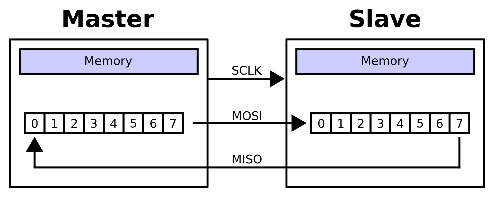
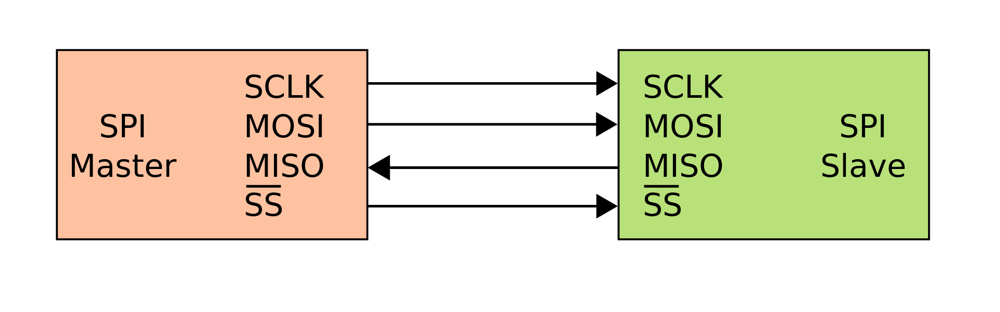
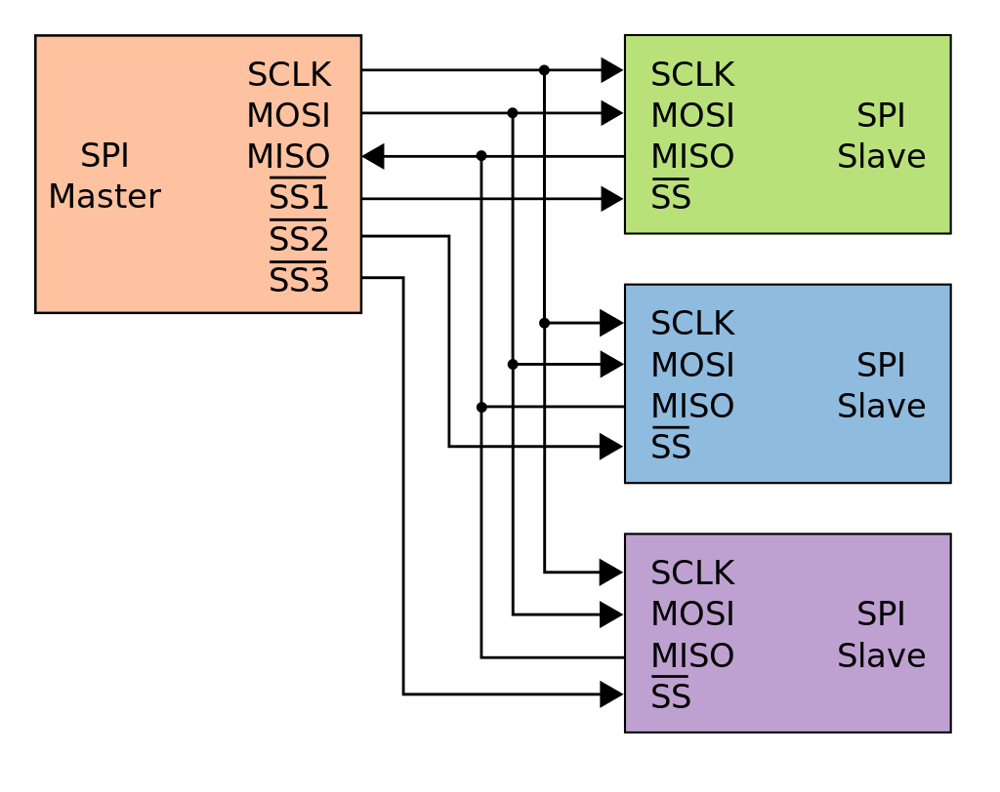
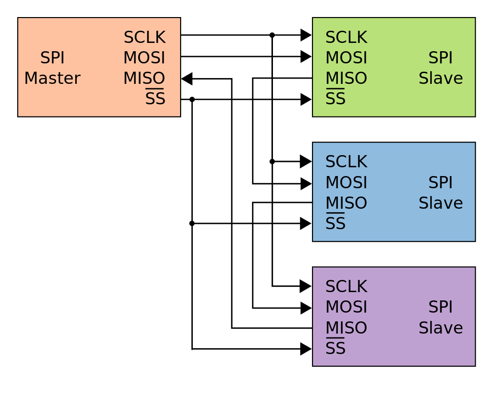
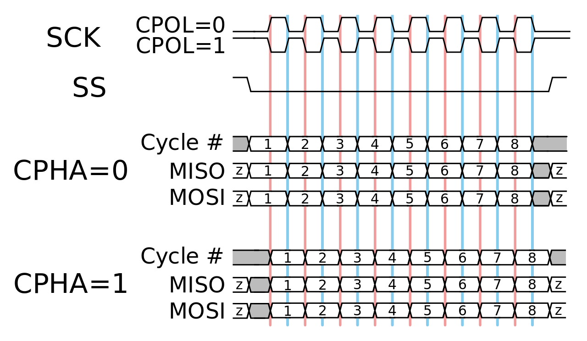

# SPI bus

SPI или SPI bus – serial peripheral interface, разработан фирмой Motorola. Последовательный синхронный стандарт передачи данных в режиме полного дуплекса. Использует 4 проводника: SCLK (тактирование), MOSI (данные от ведущего к ведомому), MISO (данные от ведомого к ведущему), SS (выбор ведомого); подробнее см. ниже.

С технической точки зрения SPI - синхронный интерфейс. Фактически это соединение двух синхронных сдвиговых регистров, которые являются центральным элементом любого SPI устройства.

Для соединения используется конфигурацию ведущий/ведомый. Только ведущий может генерировать импульсы синхронизации. 
В схеме подключения всегда только один ведущий (в отличие от той же шины I²C, где возможен вариант с более чем одним ведущим), количество ведомых может быть различно. В общем случае выход ведущего соединяется со входом ведомого, и наоборот, выход ведомого соединяется со входом ведущего.

В SPI используются четыре цифровых сигнала:
* MOSI — выход ведущего, вход ведомого (Master Out, Slave In), служит для передачи данных от ведущего устройства ведомому 
* MISO — вход ведущего, выход ведомого (Master In, Slave Out), служит для передачи данных от ведомого устройства ведущему
* SCLK или SCK — последовательный тактовый сигнал (Serial Clock), служит для передачи тактового сигнала для ведомых устройств
* *CS или SS — выбор микросхемы илм выбор ведомого (Chip Select, Slave Select); обычно является инверсным, то есть активным считается низкий уровень.

Частота следования битовых интервалов в линиях передачи данных определяется синхросигналом SCK, который генерирует ведущее устройство. Ведомые устройства используют синхросигнал для определения моментов изменения битов на линии данных. При этом ведомые устройства никак не могут влиять на частоту следования битовых интервалов.

Как в ведущем устройстве, так и  ведомом устройстве имеется счетчик импульсов синхронизации (битов). Счетчик в ведомом устройстве позволяет последнему определить момент окончания передачи пакета. Счетчик сбрасывается при выключении подсистемы SPI, такая возможность всегда имеется в ведущем устройстве. В ведомом устройстве счетчик обычно сбрасывается деактивацией интерфейсного сигнала SS.

Так как действия ведущего и ведомого устройства тактируются одним и тем же сигналом, то к стабильности этого сигнала не предъявляется никаких требований, за исключением ограничения на длительность полупериодов, которая определяется максимальной рабочей частотой более медленного устройства. Это позволяет использовать SPI в системах с низкостабильной тактовой частотой, а также облегчает программную эмуляцию ведущего устройства.

При подаче импульсов синхронизации на выход SCK, данные выталкиваются ведущим с выхода MOSI, и захватываются ведомым по входу MISO. Таким образом если подать количество импульсов синхронизации соответствующее разрядности сдвигового регистра, то данные в регистрах обменяются местами. Отсюда следует что SPI всегда работает в полнодуплексном режиме. А вот нужны ли нам данные, полученные от устройства при записи какого-либо параметра, это уже другой вопрос. Часто бывает что данные полученные от устройства при записи в него данных являются мусором (в таком случае можно просто игнорировать), но мы их получим вне зависимости от нашего желания.

### Приём и передача данных по SPI

Передача осуществляется пакетами. Длина пакета, как правило, составляет 1 байт (8 бит). Возможны реализации SPI с иной длиной пакета. Ведущее устройство инициирует цикл связи установкой низкого уровня на выводе выбора подчиненного устройства (SS) того устройства, с которым необходимо установить соединение. При низком уровне сигнала SS:
* схемотехника ведомого устройства находится в активном состоянии
* вывод MISO переводится в режим «выход»
* тактовый сигнал SCLK от ведущего устройства воспринимается ведомым и вызывает считывание на входе MOSI значений передаваемых от ведущего битов и сдвиг регистра ведомого устройства.

Подлежащие передаче данные ведущее и ведомое устройства помещают в сдвиговые регистры. После этого ведущее устройство начинает генерировать импульсы синхронизации на линии SCLK, что приводит к взаимному обмену данными. Передача данных осуществляется бит за битом от ведущего по линии MOSI и от ведомого по линии MISO. Передача осуществляется, как правило, начиная со старших битов, но некоторые производители допускают изменение порядка передачи битов программными методами. После передачи каждого пакета данных ведущее устройство, в целях синхронизации ведомого устройства, может перевести линию SS в высокое состояние.

Существует несколько способов включения SPI-устройств. 
Самый простой - подключить всех ведомых параллельно, кроме сигнала выбора ведомого.

Недостаток такого подхода  - необходимость иметь на каждое устройство собственный сигнал для выбора ведомого CS.

Подключение по каскадной схеме ("гирлянда" или "кольцо").

Здесь используется общий сигнал выбора ведомого для всех ведомых. Выход каждого из ведомых соединяется со входом следующего. Выход последнего ведомого соединяется со входом ведущего, таким образом образуется замкнутая цепь. При таком подключении можно считать что последовательно соединённые устройства образуют один большой сдвиговый регистр. Соответственно, данные можно записать во все устройства «за один присест», предварительно собрав нужный пакет, объединяющий данные для каждого из устройств в порядке соответствующем физическому порядку соединения. 

### Режимы работы интерфейса SPI

Возможны четыре комбинации фазы (CPHA) и полярности (CPOL) сигнала SCLK по отношению к сигналам данных. Режимы работы определяются комбинацией бит CPHA и CPOL:
* CPOL = 0 — сигнал синхронизации начинается с низкого уровня
* CPOL = 1 — сигнал синхронизации начинается с высокого уровня
* CPHA = 0 — выборка данных производится по переднему фронту сигнала синхронизации
* CPHA = 1 — выборка данных производится по заднему фронту сигнала синхронизации

Для обозначения режимов работы интерфейса SPI принято следующее соглашение:
* режим 0 (CPOL = 0, CPHA = 0)
* режим 1 (CPOL = 0, CPHA = 1)
* режим 2 (CPOL = 1, CPHA = 0)
* режим 3 (CPOL = 1, CPHA = 1)

Временные диаграммы работы интерфейса SPI:

При CPOL=0: CPHA = 0 (красная вертикальная линия) и CPHA = 1 (синяя вертикальная линия).

При CPOL=1: CPHA = 1 (красная вертикальная линия) и CPHA = 0 (синяя вертикальная линия).
